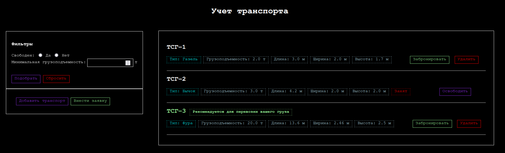

<div style="text-align: center;">

### Санкт-Петербургский Национальный Исследовательский Университет Информационных технологий, механики и оптики

<br>
<br>
<br>
<br>
<br>
<br>
<br>
<br>
<br>
<br>

## Домашнее задание

ПО для учета грузового транспорта
</div>

<br>
<br>
<br>
<br>
<br>
<br>
<br>
<br>
<br>
<br>
<br>
<br>

<div style="text-align: right;">
Выполнил: Кожухов Иван Витальевич

Группа №  К3123

Проверила: Казанова
Полина Петровна
</div>

<br>
<br>
<br>
<br>
<br>
<br>
<br>
<br>

<div style="text-align: center;">
Санкт-Петербург

2022
</div>

<br>
<br>
<br>
<br>
<br>
<br>

### Цель работы:

Создать программное обеспечение учета грузового транспорта для Автотранспортного отдела логистической компании.

#

### Задачи:

* Реализовать сохранение данных в БД.

* Реализовать логику и интерфейс для выполнения следующих задач: 
    1. Добавление/удаление грузового транспорта;
    2. Просмотр доступного транспорта;
    3. Просмотр грузового транспорта по грузоподъемности;
    4. Просмотр свободного грузового транспорта;
    5. Внесение заявки на перевоз груза по указанным габаритам;
    6. Подбор и бронирование транспорта;
    7. Просмотр занятого грузового транспорта;

#

### Ход работы:

### 1. Проектирование

Первым делом нужно было выбрать стек технологий для создания ПО. В качестве БД была выбрана `SQLite`, так как это легкая встраиваемая БД, не требующая развертывания и настройки сервера, в отличие от, например, `MySQL` и `PostgreSQL`. Для взаимодействия с пользователем было решено написать простое Web-приложение с server-side рендерингом страниц. Для обработки HTTP-запросов был выбран фреймворк `Flask` так как является легким и небольшим фреймворком, в отличие от крупных аналогов вроде `Django`. Для рендеринга страниц используется шаблонизатор `Jinja2`.

Для эффективной реализации хранения данных была составлена схема БД *(Рис. 1)*. В БД представлены 2 таблицы — *`types`*, для хранения данных о типах транспорта, и *`transport`*, для хранения данных о единицах транспорта.


<div style="text-align: center;">Рис. 1. Схема БД</div>
<br>

Так, как работа выполняется в парадигме ООП, была составлена диаграмма классов *(Рис. 2)*, которые будут использоваться в программе.


<div style="text-align: center;">Рис. 2. Диаграмма классов</div>
<br>

В программе присутствуют 3 класса: 
* *`Type`* — тип транспорта, отображение сущностей из таблицы types;
* *`Transport`* — единица транспорта, отображение сущностей из таблицы transport
* *`DbWorker`* — класс, содержащий в себе функции для взаимодействия с БД.

При инициализации класс *`DbWorker`* считывает файл *`schema.sql`* *(Фраг. 1)* из директории проекта и выполняет его инструкции в БД.
Файл *`schema.sql`* содержит в себе инструкции для создания таблиц и наполнения их необходимыми значениями.

```sql
DROP TABLE IF EXISTS types;
DROP TABLE IF EXISTS transport;

CREATE TABLE types (
	id INTEGER PRIMARY KEY AUTOINCREMENT,
	name TEXT NOT NULL,
	capacity REAL NOT NULL,
	min_length REAL NOT NULL,
	min_width REAL NOT NULL,
	min_height REAL NOT NULL,
	max_length REAL NOT NULL,
	max_width REAL NOT NULL,
	max_height REAL NOT NULL
);

INSERT INTO types (
	name,
	capacity,
	min_length,
	max_length,
	min_width,
	max_width,
	min_height,
	max_height
) VALUES ('Газель', 2, 3, 3, 2, 2, 1.7, 2.2),
		 ('Бычок', 3, 4.2, 5, 2, 2.2, 2, 2.4),
		 ('MAN-10', 10, 6, 8, 2.45, 2.45, 2.3, 2.7),
		 ('Фура', 20, 13.6, 13.6, 2.46, 2.46, 2.5, 2.7);

CREATE TABLE transport (
		id INTEGER PRIMARY KEY AUTOINCREMENT,
		name TEXT NOT NULL,
		type_id INTEGER NOT NULL REFERENCES types(id),
		length REAL NOT NULL,
		width REAL NOT NULL,
		height REAL NOT NULL,
		is_busy INTEGER NOT NULL DEFAULT 0
);

INSERT INTO transport (
		type_id,
		name,
		length,
		width,
		height,
		is_busy
		) VALUES 
		(1, 'ТСГ-1', 3, 2, 1.7, 0),
		(2, 'ТСГ-2', 4.5, 2, 2, 1);
```
<div style="text-align: center;">Фраг. 1. Файл schema.sql</div>
<br>

### 2. Написание кода

В модуле *`dbworker`* были описаны классы *`Type`* и *`Transport`* *(Фраг. 2)*, представленные на диаграмме.

```python
class Type:
    def __init__(self, id, name, capacity, minLength, maxLength, minWidth, maxWidth, minHeight, maxHeight):
        self.id = id
        self.name = name
        self.capacity = capacity
        self.minLength = minLength
        self.maxLength = maxLength
        self.minWidth = minWidth
        self.maxWidth = maxWidth
        self.minHeight = minHeight
        self.maxHeight = maxHeight

    def from_dict(t):
        return Type(
                t['types_id'],
                t['types_name'],
                t['types_capacity'],
                t['types_min_length'],
                t['types_max_length'],
                t['types_min_width'],
                t['types_max_width'],
                t['types_min_height'],
                t['types_max_height']
            )

class Transport:
    def __init__(self, id, name, _type, length, width, height, isBusy = False):
        self.id = id
        self.name = name
        self.type = _type
        self.length = length
        self.width = width
        self.height = height
        self.isBusy = isBusy

    def from_dict(t):
        return Transport(
            t['transport_id'], 
            t['transport_name'], 
            Type.from_dict(t),
            t['transport_length'], 
            t['transport_width'], 
            t['transport_height'], 
            bool(t['transport_is_busy'])
        )
```
<div style="text-align: center;">Фраг. 2. Классы Type и Transport</div>
<br>

Затем был написан класс *`DbWorker`*, полный код можно увидеть в файле [dbworker.py](./dbworker.py).

После этого было начато написание бэкенда и интерфейса.

В файле [main.py](./main.py) создается объект класса *`Flask`* и указываются конечные точки для HTTP-запросов *(Фраг. 3)*.

```python
from flask import Flask, render_template, request
from dbworker import DbWorker

app = Flask(__name__)
db = DbWorker()

@app.route('/')
def home():
    data = []
    busy = request.args.get('busy')
    min_capacity = request.args.get('min_capacity')
    rec_id = request.args.get('rec_id')

    try:
        rec_id = int(rec_id)
    except:
        pass

    if busy == 'true':
        data = db.get_all_transport_by_busy_and_capacity(1, min_capacity if min_capacity else 0)
    elif busy == 'false':
        data = db.get_all_transport_by_busy_and_capacity(0, min_capacity if min_capacity else 0)
    elif min_capacity:
        data = db.get_all_transport_by_capacity(min_capacity)
    else:
        data = db.get_all_transport()

    return render_template('home.html', transport=data, busy=busy, min_capacity=min_capacity, rec_id=rec_id)
```
<div style="text-align: center;">Фраг. 3. Пример описания конечной точки "/"</div>
<br>

В директории [templates](./templates/) находятся шаблоны HTML , в которые шаблонизатором *`Jinja2`* подставляются нужные значения. Все шаблоны *(Фраг. 5)* наследуются от базового шаблона [base.html](./templates/base.html) *(Фраг. 4)*.

```html
<!DOCTYPE html>
<html lang="en">
  <head>
    <meta charset="utf-8">
    <meta name="viewport" content="width=device-width, initial-scale=1, shrink-to-fit=no">

    <style>
        <!-- CSS -->
        ...
    </style>

    <title> </title>
  </head>
  <body>

    <div class="sidebar">
    	 
    </div>
    <div class="container">
         
    </div>

  </body>
</html>
```
<div style="text-align: center;">Фраг. 4. Базовый шаблон</div>
<br>

```html



    <!-- код для панели фильтров -->
    ...



		<h1 class="header">Учет транспорта</h1>
		<div class="main-list">
		
			<span class="list-tag tag-red">
				Подходящий транспорт для перевозки вашего груза не был найден
			</span>
		
		
				<h2  style="color: lightgreen;" >{{ car.name }}

				
				<span class="list-tag tag-green" style="font-size: 15px;">
					Рекомендуется для перевозки вашего груза
				</span>
				
				</h2>
				<span class="list-tag tag-cyan">Тип: {{ car.type.name }}</span>
				<span class="list-tag tag-blue">Грузоподъемность: {{ car.type.capacity }} т</span>
				<span class="list-tag tag-blue">Длина: {{ car.length }} м</span>
				<span class="list-tag tag-blue">Ширина: {{ car.width }} м</span>
				<span class="list-tag tag-blue">Высота: {{ car.height }} м</span>
				
						<span class="list-tag tag-red">Занят</span>
				
					
						<a class="button tag-green" style="margin-right: 10px; margin-left: 60px;" href="{{ url_for('reserve_car', id=car.id) }}">Забронировать</a>
						<a class='button tag-red' href="{{ url_for('delete_car', id=car.id) }}" onclick="if (!(confirm('Удалить {{ car.name }}?'))) return false" >Удалить</a>
					
						<a style="margin-left: 100px;" class='button tag-violet' href="{{ url_for('unreserve_car', id=car.id) }}">Освободить</a>
					
				<hr style="margin-top: 30px;">
		
		</div>



```
<div style="text-align: center;">Фраг. 5. Пример - шаблон home, наследующийся от base</div>
<hr>

### Работа программы

При открытии главной страницы *(Рис. 3)*, отображается интерфейс. В правой части присутствует список единиц транспорта с их характеристиками, отметкой о занятости транспорта, а также кнопками действий. Если транспорт не занят, для него доступны действия **Забронировать** и **Удалить**. Если занят - доступно действие **Освободить**. При нажатии на кнопку происходит запрос на соответствующую конечную точку, выполнение требующихся действий и переадресация пользователя обратно на главную страницу.


<div style="text-align: center;">Рис. 3. Главная страница</div>
<br>

В левой части находится меню фильтрации по занятости и минимальной грузоподъемности, а также кнопки для добавления нового транспорта и внесения заявки на перевозку груза. При применении фильтрации происходит запрос на конечную точку `/` с параметрами для фильтрации. Сервер обрабатывает параметры и возвращает страницу с отфильтрованным списком транспорта.

При нажатии на кнопку **Добавить транспорт**, происходит переадресация на страницу выбора типа *(Рис. 4, конечная точка `/select-type`)*.


<div style="text-align: center;">Рис. 4. Выбор типа</div>
<br>

Выбор типа происходит на отдельной странице, поскольку каждый тип имеет свои ограничения по размерам, которые надо отразить в форме создания новой единицы транспорта. Если бы выбор типа происходил в той же форме, где и выбор остальных параметров, невозможно было бы ограничивать размеры в зависимости от выбранного типа, не прибегая к использованию JavaScript и созданию дополнительных конечных точек для получения информации о типах. В нашем же случае, проще сначала сделать выбор типа, а затем, на основании ограничений этого типа, выдать страницу с формой выбора параметров. При нажатии на кнопку **Далее** происходит POST-запрос на сервер и переадресация на страницу добавления единицы транспорта конкретного типа *(Рис. 5, конечная точка `/add-car/<type_id>`)*.


<div style="text-align: center;">Рис. 5. Добавление транспорта</div>
<br>

На этой странице отображаются поля для заполнения параметров транспорта. Они ограничены для каждого конкретного типа. Изначальное значение устанавливается на минимальное. Если для поля возможно только одно значение, поле является `readonly` и отображается менее ярким, чем остальные. При нажатии на кнопку **Добавить** происходит POST-запрос на сервер, добавление транспорта и переадресация пользователя на главную страницу.

<hr>

При нажатии на кнопку **Внести заявку** на главной странице, происходит переадресация на страницу внесения заявки *(Рис. 6, конечная точка `/add-request`)*. Здесь вводятся габариты груза для перевозки, при нажатии на кнопку **Отправить** происходит POST-запрос на сервер, подбор подходящего транспорта и переадресация пользователя на главную страницу, с указанием id рекомендуемого транспорта для перевозки груза *(Рис. 7)*.


<div style="text-align: center;">Рис. 6. Внесение заявки</div>
<br>


<div style="text-align: center;">Рис. 7. Рекомендация транспорта</div>
<br>

Если подходящий транспорт не был найден, на главной странице будет выведено сообщение об этом.


<div style="text-align: center;">Рис. 8. Подходящий транспорт не найден</div>

<hr>

### Вывод:
В ходе выполнения задания я научился работать с фреймворком *`Flask`* и шаблонизатором *`Jinja2`*.